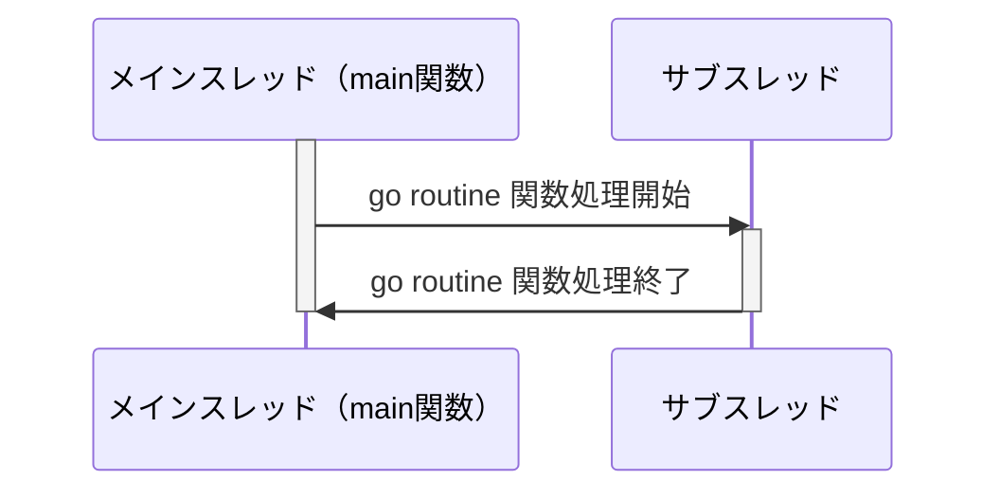
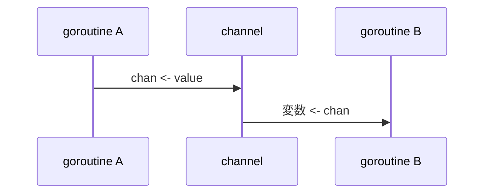

# Goroutine について

## 概要

### Goroutine とは

- Go ランタイムによって管理される`軽量な並行処理スレッド(コルーチン)`のこと
- main 関数で実行される処理を`メインゴルーチン`と呼ぶ
- スレッド数やメモリアクセスの管理などの複雑な作業はランタイムが管理する

### 実装方法

```
// 関数の前に go キーワードを追加する
go f(x,y,z)
```

### 処理の概要図



### Channel とは

> Channels are the pipes that connect concurrent goroutines. You can send values into channels from one goroutine and receive those values into another goroutine.
> (チャネルは、同時実行するゴルーチンを接続するパイプです。あるゴルーチンからチャネルに値を送信し、それらの値を別のゴルーチンに受け取ることができます。)

同時実行している goroutine 間でデータの送受信ができる機能のこと。

### Channel の実装

```
// 通信データがintの場合
var ch chan int

// make関数で定義する場合
ch := make(chan int)
```

### データの送受信

`<-`演算子を使って送受信を定義します。
`<-`はデータが入るチャネルの方向を示して、送信は`chan<-`、受信は`<-chan`と表します。

```
// チャネル:chにデータ:vを送信する
ch <- v

// チャネル:chからデータを受信してvに代入する
v := <- ch
```



### Channel の種類

チャネルにはバッファードチャネル(Buffered Channel)とアンバッファードチャネル(Unbuffered Channel)の２種類あります。デフォルトはアンバッファードチャネルです。バッファードチャネル(Buffered Channel)は、それに対応する受信（<-chan）がなくても、限られた数の値を受け入れます。

## 参考

[Goroutine と channel](https://zenn.dev/mikankitten/articles/6344d71f4f4920)
